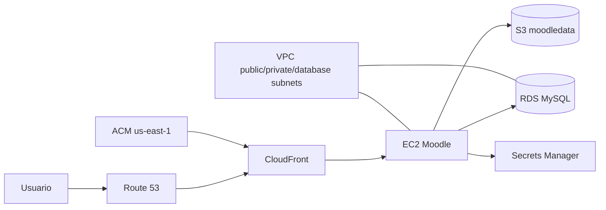

# moodle-terraform

Laboratorio Terraform para provisionar Moodle na AWS com EC2, RDS, S3, CloudFront, Route 53 e ACM.

## Objetivo

Construir uma arquitetura Moodle reproduzivel com infraestrutura como codigo, usando modulos oficiais da comunidade `terraform-aws-modules` e validacao automatica no GitHub Actions.

## Arquitetura



## Recursos

| Camada | Recursos |
| --- | --- |
| Rede | VPC, subnets publicas, privadas e database, NAT Gateway unico para laboratorio |
| Seguranca | Security groups para web e banco, IAM role da instancia |
| Aplicacao | EC2 com Apache, PHP e Moodle via `user_data` |
| Dados | RDS MySQL privado com senha gerenciada pelo Secrets Manager |
| Storage | Bucket S3 privado, versionado e criptografado para `moodledata`/artefatos |
| Borda | CloudFront com certificado ACM e alias no Route 53 |

## Instalacao Automatica

A instancia EC2 executa `templates/user_data_moodle.sh.tftpl` no bootstrap para:

- instalar Apache, PHP, extensoes PHP, MariaDB client, AWS CLI, Git e jq;
- baixar o Moodle a partir da branch `MOODLE_405_STABLE`;
- criar `/var/www/moodledata`;
- buscar a senha do RDS no Secrets Manager;
- buscar a senha admin inicial do Moodle no Secrets Manager;
- executar `admin/cli/install.php` em modo nao interativo.

## Modulos Oficiais

- `terraform-aws-modules/vpc/aws`
- `terraform-aws-modules/security-group/aws`
- `terraform-aws-modules/rds/aws`
- `terraform-aws-modules/s3-bucket/aws`
- `terraform-aws-modules/ec2-instance/aws`
- `terraform-aws-modules/route53/aws`
- `terraform-aws-modules/acm/aws`
- `terraform-aws-modules/cloudfront/aws`

## Como Validar

```bash
terraform fmt -recursive
terraform init -backend=false
terraform validate
```

## Como Planejar

1. Copie `terraform.tfvars.example` para `terraform.tfvars`.
2. Ajuste `domain_name`, `hosted_zone_name`, `ami_id`, `ssh_allowed_cidrs` e `moodle_admin_email`.
3. Autentique na AWS com um perfil de laboratorio.
4. Rode `terraform plan` e revise os custos antes de qualquer apply.

## Cuidados

- Este projeto ainda e um laboratorio, nao uma arquitetura de producao.
- `single_nat_gateway = true` reduz custo, mas nao entrega alta disponibilidade entre AZs.
- A senha admin inicial e gerada pelo Terraform e armazenada no Secrets Manager.
- A zona Route 53 criada precisa estar delegada no registrador do dominio para ACM e DNS funcionarem.
- Nenhum recurso AWS foi aplicado durante a criacao deste repositorio.

## Status

Base funcional de infraestrutura concluida e validada com `terraform validate`.

## Roadmap

- Adicionar backend remoto S3/DynamoDB para state.
- Evoluir para ALB entre CloudFront e EC2.
- Separar modulo reutilizavel para aplicacoes Moodle.
- Adicionar observabilidade com CloudWatch Agent.
- Integrar S3 como storage externo do Moodle com plugin/configuracao dedicada.
